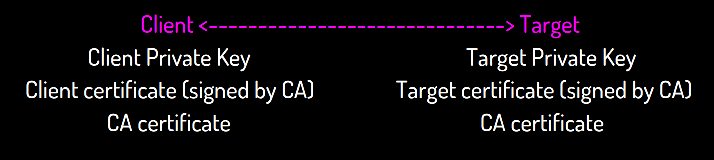

# gNMI


### gRPC Network Management Interface (gNMI)

> gRPC기반에 디바이스의 설정을 수정 또는 조회할수 있는 프로토콜로 원격으로 디바이스를 제어하고 스트림으로 데이터를 받아올수 있다. 하나의 gRPC service 정의로 제어와 조회를 모두 가능하게 되어있다. (하나의 NMS로 디바이스의 정보를 조회 또는 설정을 할 수 있다.)


모든 메시지는 gRPC service에 정의되고 protocol buffer로 사용된다. gRPC service는 protobuf IDL로 기능을 표현된 내용을 통해 정의된다. 


- 용어
  - Telementry - device에 근본적이 문자 데이터들을 streaming 한다. (either operational state or configuration)
  - Configuration - 읽고 쓰는 데이터형태이고 client에 의해 조작된다.
  - Target - 데이터가 조작되거나 report되는 디바이스이다. 보통 network device이다.
  - Client - target을 query/modify 하기위해 표현된 protocol 데이터를 사용하는 device 혹은 system, data를 스트리밍하여 collector로 사용되기도 한다. 보통은 network management system이다.


### gNMI란?

- Configuration을 다루고, state를 읽어올 수 있는 프로토콜
  - gNMI를 통에 데이터를 다룰때 name들과 map<stirng,string> 로 구성된 path를 구성할 수 있어야한다.
  - 꼭 YANG-model일 필요는 없다.
- gRPC를 바탕으로 개발되었다. google에 의해 개발된 오프소스이고 CNCF에서 관리하고 있다.
  - RPC는 HTTP/2로 만들어져있다.
  - 서버 스트리밍, 클라이언트 스트리밍, 양방향 스트리밍


### gNMI를 사용하는 이유

> 플랫폼 개발에 있어서 CLI와 같은 구조화 되지 않은 방법은 핸들링이나 관리에 있어서 어려움이 많다.

- CLI는 프로그래밍을 할 수 없다.
  - 트렌젝션 관리가 어렵다.
  - 구조화 되지않아 error 핸들링이 어렵다.
  - 구조나 커맨드 문법이 바뀐다.
- gNMI vs Openflow
  - Openflow -> Forwarding Plane
    - Packet A goes to X
  - gNMI -> Platform
    - Configuration
    - Hardware/Software
    - Environmental/Power


### gNMI 구성

> gRPC, gNMI, Tree-structured data 로 구성된다.

- gRPC - transport
  - High 퍼포먼스의 RPC framework로 어떤 환경에서도 실행할 수 있다.
- gNMI - action
  - Get/Set/Subscribe/Capabilities (proto 파일을 통해 서비스를 정의한다)
- Tree-structured data - properties
  - OpenConfig - YANG data models


### gNMI - 서비스 정의

> gnmi는 다음과같이 서비스를 정의할 수 있다.

```protobuf
service gNMI {
 rpc Capabilities(CapabilityRequest) returns (CapabilityResponse);
 rpc Get(GetRequest) returns (GetResponse);
 rpc Set(SetRequest) returns (SetResponse);
 rpc Subscribe(stream SubscribeRequest) returns (stream SubscribeResponse);
}
```

- Server is named Target
- Target always authenticates Client
- Client always authenticates Target
- Session is always encrypted


1. gNMI SET - (delete, replace & update)

   ```protobuf
   message SetRequest {
    <...>
    repeated Path delete = 2;
    repeated Update replace = 3;
    repeated Update update = 4;
   }
   ```

   - SET은 Transactional 하다. (중간에 다른 트랜젝션이 끼어들 수 없다.)
   - Steate는 설정전체가 accepted 되지 않으면 바뀌지 않는다.


2. Subscribe - (streaming telemetry)

   ```protobuf
   service gNMI {
    <...>
    rpc Subscribe(stream SubscribeRequest) returns (stream SubscribeResponse);
   }
   ```

   - path에 subscribe를 하여 사용한다.
   - subscription modes
     - STREAM - 같이 바뀌는걸 전송한다.
     - ONCE - 하나의 값을 전송하고 channel을 닫는다.
     - POLL - actively polls for the value


3. Capabilities

   ```
   service gNMI {
    rpc Capabilities(CapabilityRequest) returns (CapabilityResponse);
    <...>
   }
   
   message CapabilityResponse {
    repeated ModelData supported_models = 1; // Supported schema models.
    repeated Encoding supported_encodings = 2; // Supported encodings.
    string gNMI_version = 3; // Supported gNMI version.
   }
   ```


### Encoding

> gNMI의 Encoding 정의 이다.

```
enum Encoding {
 JSON = 0; <-----(rfc7159)- OKish
 BYTES = 1;
 PROTO = 2;
 ASCII = 3;
 JSON_IETF = 4; <-(rfc7951)- Prefered (made for YANG)
}
```


### Certificates

> gNMI를 통한 session은 인증된 상태이다.

- 만드시 인증서를 사용한다.
- 클라이언트는 Target에 인증해야 한다.
- Target도 Client를 인증해야된다.





참고

- https://github.com/openconfig/reference/blob/master/rpc/gnmi/gnmi-specification.md
- https://2017.conference.faucet.nz/slides/Sam%20Ribeiro%20-%20gNMI%20tech%20preso.pdf
- https://datatracker.ietf.org/meeting/101/materials/slides-101-netconf-grpc-network-management-interface-gnmi-00